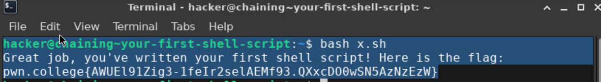

# Your first shell script
the objective for this challenge is to run the given commands using a script file x.sh and then run it in the terminal to get the glag.

## My solve
**Flag:** `pwn.college{AWUEl91Zig3-1feIr2selAEMf93.QXxcDO0wSN5AzNzEzW}`

in this challenge i first wrote a file named x.sh in whixh i wrote the cmds /challenge/pwn;/challenge/college after which i ran it in the terminal to get the flag.\

## What I learned
i learned about scripts and how to run it using bash.

## References 
None.
