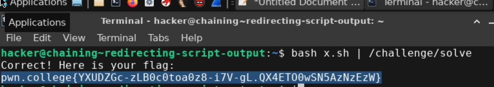

# redirecting script output
the objective for this challenge is to pipe the output of script to the given command to get the flag.

## My solve
**Flag:** ` pwn.college{YXUDZGc-zLB0c0toa0z8-i7V-gL.QX4ETO0wSN5AzNzEzW}`

in this challenge i piped the previous made x.sh script to /challenge/solve to get the flag.\

## What I learned
i learned how to pipe output of a script to a command.

## References 
None.
